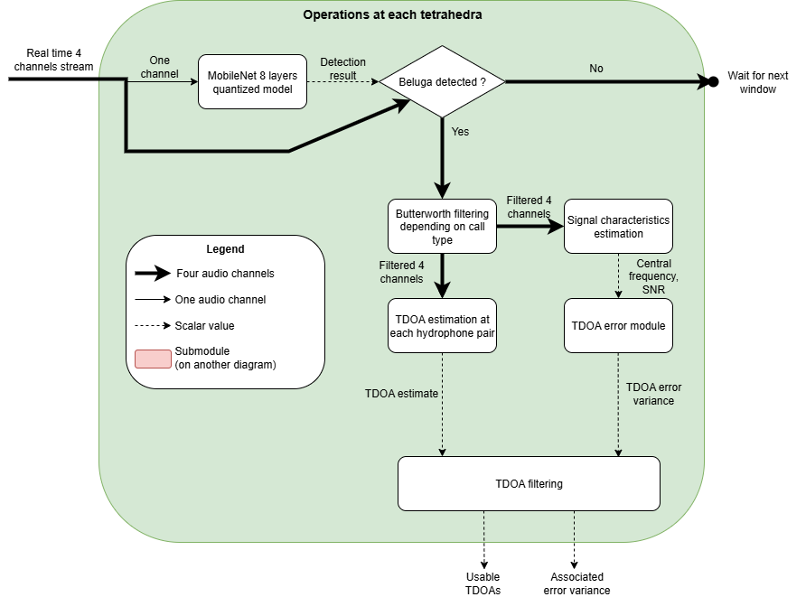
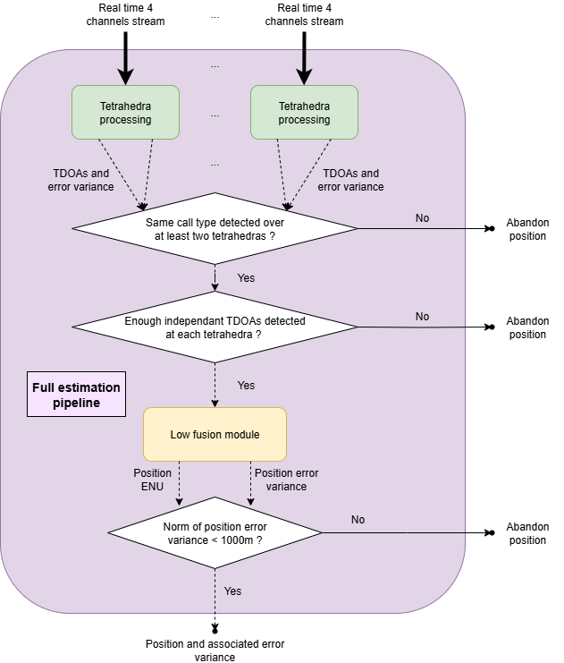
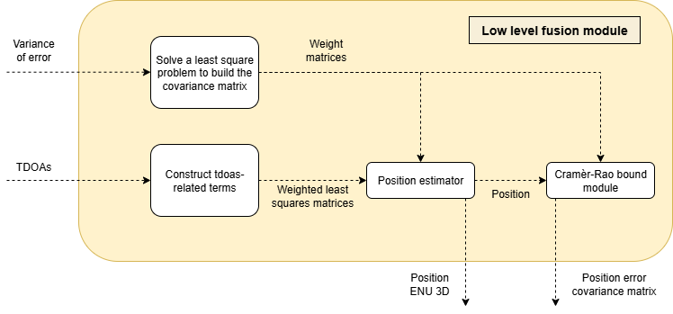

# Beluga watch

Repository that implements algorithms for real time localisation of belugas from hydrophones. To use this code, it is enough to read the Project global description section.

To ensure all modules are installed, please run

```
pip install -r requirements.txt
```

## Project global description

In this part, we briefly go through the repository's arborescence to explain as clearly as possible what each part of the code does.

### Arborescence

The repository is organized as such :

```
beluga-watch/
├── requirements.txt
├── main_module.py
├── beluga_control_board.py
├── data_for_control_board.py
├── src/
│   ├── denoising_bricks/
│   │   ├── igff.py
│   │   ├── imfs_choice.py
│   │   ├── vmd_denoising.py
│   │   ├── vmd.py
│   │   └── woa.py
│   ├── detection_bricks/
│   │   ├── canals_matching.py
│   │   └── mono_audio_detection.py
│   ├── location_bricks/
│   │   ├── frequencies_filtering.py
│   │   ├── high_level_fusion.py
│   │   ├── low_level_fusion.py
│   │   └── tdoa_brick.py
│   ├── tests/
│   │   ├── benchmark.py
│   │   ├── debug_functions.py
│   │   ├── heatmap_crb.py
│   │   └── ziv_zakai.py
│   └── utils/
│       ├── dashboard.py
│       ├── four_can_generator.py
│       ├── plots.py
│       ├── rotation_bricks.py
│       ├── sub_classes.py
│       └── wav_parser.py
├── jsons/
│ ├── environments/
│ ├── models/
│ └── parameters/
└── noises/
```

### Flowchart of the algorithm








### Notations

- $M$ is the number of tetrahedras
- $N$ is the amount of pairs of hydrophones at a tetrahedra (default is 6)
- $N_i$ is the amount of valid pairs of hydrophones at tetrahedra $i$ : $N_i \le N$ (cf later)

### Repository codes

#### Code principal :

``main_module.py`` : Code principal, dont la fonction ``positions_from_audio()`` prend en entrée des chemins vers des environnements (cf classes en-dessous), des paramètres, un modèle, et $M$ fichier audios **SYNCHRONISES** (càd de même durée et dont les fenêtre de temps sont identiques); et renvoie les positions dans le référentiel ENU de l'environnement, la variance de l'erreur attendue en position, les temps associés, et les types de calls de bélugas associés.

*Syntaxe :* 

```python
audio_path = ['path_to_wav_8296.wav','path_to_wav_8295.wav']
model_path = 'jsons/models/mobile_net_overlaps.pt'
param_path = 'jsons/parameters/default_parameters.json'
env_path = 'jsons/environments/env_cacouna.json'

positions, errors, timestamps, durations, call_types = positions_from_audio(model_path, env_path, param_path, audio_path)
```

#### Code pour l'interface :

``data_for_control_board.py`` : Code permettant de plotter les résultats en simulant du temps réel avec une interface.

*Utilisation du dahsboard :* 

``positions, errors, timestamps, durations, call_types = la sortie de positions_from_audio``

Pour appeler le dashboard, il suffit de rajouter les audio_files (les mêmes que pour positions_from_audio), une liste de groundtruths [(lat1, lon1), (lat2, lon2), ...]
et l'environnement (le même que pour positions_from_audio) sous la forme:
set_dashboard(audio_files, positions, errors, timestamps, durations, call_types, groundtruths, environment)

Le code va tourner, jusqu'à voir "Running on http://127.0.0.1:8050", il faut copier l'adresse (http://127.0.0.1:8050) dans le navigateur.

Le dashboard ne fonctionne que pour deux tétraèdres présentement.

On trouve les deux spectogrammes en haut avec les cris de béluga encadrés.
En bas à gauche avec les groundtruths en orange, les positions estimées en rouge et les tétraèdres sont les triangles violets.
En bas à droite un tableau qui récapitule les données des positions prédites.

Il faut obligatoirement écrire ce code pour exécuter le dashboard:
if __name__ == "__main__":
    app = set_dashboard(audio_path, positions, errors, timestamps, durations, call_types, groundtruths, environment)
    app.run(debug=False)

ça prend le "if __name__ == "main" obligatoirement sinon ça ne marchera pas.

*Syntaxe :* 

```python
audio_path = ['path_to_wav_8296.wav','path_to_wav_8295.wav']
model_path = 'jsons/models/mobile_net_overlaps.pt'
param_path = 'jsons/parameters/default_parameters.json'
env_path = 'jsons/environments/env_cacouna.json'

positions, errors, timestamps, durations, call_types = positions_from_audio(model_path, env_path, param_path, audio_path)

groundtruths_to_plot = [(lat1, lon1) , (lat2,lon2)] #lat ~ 47, lon ~ -69

app = set_dashboard(audio_path, positions, errors, timestamps, durations, call_types, groundtruths_to_plot, environment)
app.run(debug=False)
```

### Test codes

This folder (src/tests/) contains Python files that were used to produce validations / figures. 

#### Testing different filters and algorithms :

``benchmark.py`` : This is the code used to try different filters (Butterworth, FIR, Ideal filter), different codes (Low or high fusion), or more generally, any different parameters.

*Syntaxe :*

```python
from src.utils.four_can_generator import all_arrays_from_pos
from src.utils.sub_classes import Environment, AudioArray
from src.tests.benchmark import synthetic_benchmark
import json

all_whistle_wav_paths = ['whistle1.wav', 'whistle2.wav', 'whistle3.wav']
whistle_pos_enu = np.zeros(3)
environment = Environment('path_to_env.json')
snr_power = [[1,1,1,1],[1,1,1,1]]
corr_noise_wav_path = 'path_to_4can_boat_noise.wav' #Optional
corr_noise_pos_enu = np.array([1000,1000,0]) #Optional
non_corr_noise_path = 'path_to_4can_background_noise.wav' # Examples in the noises folder 

output_wav_paths = [['8296_1.wav','8295_1.wav'],['8296_2.wav','8295_2.wav'],['8296_3.wav','8295_3.wav']]

for whistle_wav_path, wav_name in zip(all_whistle_wav_paths, output_wav_paths) :
    audio_arrays, groundtruth = all_arrays_from_pos(
        whistle_wav_path,
        whistle_pos_enu,
        environment,
        snr_power,
        audio_length = 1.0,
        start_time = 0.0,
        corr_noise_wav_path = None,
        corr_noise_pos_enu = None,
        non_corr_noise_path = non_corr_noise_path,
    )

    for audio_array in audio_arrays:
        audio_array_to_wav(audio_array, wav_name)
    
    with open(whistle_wav_path + 'groundtruth.json', 'w') as file:
      json.dump(groundtruth, file)


audio_list = [['8296_1.wav','8295_1.wav'],['8296_2.wav','8295_2.wav'],['8296_3.wav','8295_3.wav']]
params = ['param1.json', 'param2.json']
groundtruths = [whistle_wav_path + 'groundtruth.json' for wav_path in audio_list]

dataframe = synthetic_benchmark(audio_list , groundtruths, params, environment)
dataframe.to_csv('save_path.csv')
```

#### Validation of position error model :

``heatmap_crb.py`` : Code to produce the heatmap plot 

*Syntaxe :*

```python

environment = Environment('jsons/environments/env_cacouna.json',True)
estimated_tdoa_std = (1. / 384000) / np.sqrt(12.) # fech
meshpoints = 500 # Actually there are 'meshpoints ^2' meshpoints
n_draws = 500

# Plot CRB
save_path_crb = f"save_folder/crb_meshpoints{meshpoints}_errorstd{int(estimated_tdoa_std * 384000)}fech.png"

heatmap(estimated_tdoa_std,
        environment,
        xmin=-3000,
        xmax=3000,
        ymin = -3000,
        ymax=3000,
        value_function = compute_heatmap_value,
        save_path=save_path_crb, 
        meshpoints = meshpoints)

# Plot Monte Carlo
save_path_mc = f"save_folder/montecarlo_meshpoints{meshpoints}_draws{n_draws}_errorstd{int(estimated_tdoa_std * 384000)}fech.png"

heatmap(estimated_tdoa_std,
        environment,
        xmin=-3000,
        xmax=3000,
        ymin = -3000,
        ymax=3000,
        value_function = monte_carlo_values,
        save_path=save_path_mc,
        meshpoints = meshpoints,
        nb_draws=n_draws)
```

#### Validation of the TDOA error model :

``ziv_zakai.py`` : Code to evaluate performance over the TDOA error model.

*Syntaxe :*

```python

    environment = Environment('jsons/environments/env_cacouna.json',True)
    bandwidth = 300
    duration = 1.0
    npy_folder = os.listdir("test_data/zivzakai_outputs")
    central_frequencies = np.unique([float(extract_frequency(file)) for file in npy_folder if (file.endswith('.npy') and extract_frequency(file))])
    nb_points = 20
    central_frequencies = [750.0, 1000.0, 3000.0, 10000.0, 18000.0]
    pos = np.zeros(3)
    #nb_samples_fs = 8 # Discretises the -fs/2, fs/2 segment to reach approx fs^2/12 in average
    nb_samples_fs = 1
    noises_folder = 'noises'
    central_freq_used = []
    snr_shifts = []
    richard_params = []
    all_mses = []
    if not os.path.isfile("test_data/zivzakai_outputs/outputs_pkl.pkl"):
        for central_frequency in central_frequencies:
            print(f'central_frequency : {central_frequency}')
            save_path_zzp = f"test_data/zivzakai_outputs/zivzakaiplot_3pos_{nb_points}points_{nb_samples_fs}tdoadraws_{central_frequency}fc_{int(bandwidth)}bw.png"
            save_path_numpy =f"test_data/zivzakai_outputs/zivzakaiplot_3pos_{nb_points}points_{nb_samples_fs}tdoadraws_{central_frequency}fc_{int(bandwidth)}bw.npy"
            load_path = save_path_numpy
            snrs, richard_param, mses = ziv_zakai_plot(bandwidth, duration, central_frequency,environment, nb_points = nb_points, save_path = save_path_zzp, noises_folder= noises_folder, position = pos, save_path_np = save_path_numpy, nb_samples_fs = nb_samples_fs, load_path = load_path)
            snr_shifts.append(snrs)
            richard_params.append(richard_param)
            all_mses.append(mses)
            central_freq_used.append(central_frequency)
        output_list = [central_freq_used, snr_shifts, all_mses, richard_params]
        with open("test_data/zivzakai_outputs/outputs_pkl.pkl", 'wb') as fichier_pickle:
            pickle.dump(output_list, fichier_pickle)
    else:
        with open("test_data/zivzakai_outputs/outputs_pkl.pkl", 'rb') as fichier_pickle:
            output_list = pickle.load(fichier_pickle)
    zz_results_plot(output_list)
```

*Remark :* This code avoids to recompute things as much as possible. It stores computed Monte Carlo data in numpy files (.npy), and the whole variables necessary to produce plots in a pickle (.pkl) file. 

### Utils codes

Codes potentially used as interfaces between different forms of data.

#### Plotting different outputs :

``plots.py`` : This code has several plotting functions. We give here the syntax for 2D plots.

*Syntaxe :*

```python

positions, errors, timestamps, durations, call_types = positions_from_audio(model_path, env_path, param_path, audio_path)

timestamps2 = [timestamp.strftime("%M:%S") for timestamp in timestamps]

environment = Environment(env_path, True)

two_dim_plot_enu(positions, errors, timestamps2, environment, True, groundtruths=np.array([[-572.9], [49.6]]).T, groundtruths_labels=None, call_types=call_types)
```

#### Sub classes : 

``sub_classes.py`` : This code defines the different code classes used in the project, to have an 'object oriented code' as much as possible and for better readability. Cf the section 'Main classes used in the code'.

#### Parsing audios :

``wav_parser.py`` : The code to make conversions between wavs/AudioArray lists/numpy arrays


#### Calibration code :

Pour calculer les matrices de rotation, remplacer les variables de la ligne 580 à 626 du fichier utils/main_module_calibration.py par vos valeurs puis exécuter le code du fichier.

Attention le code ne fonctionne que pour 2 tétraèdres, si on veut ajouter un autre tétraèdre, il faut rajouter en ligne 630:

```python
ROTATION_MATRIX_TETRAHEDRON_3 = find_rotation_matrix_3D(GROUNDTRUTH_T3, AUDIO_FILES_T3, START_TIME_T3, END_TIME_T3, TIME_WINDOW_DURATION, COORDINATES_T3, COORDINATES_HYDROPHONES_3, FREQUENCY_RANGE, FILTERING_METHOD, FILTER_ORDER)
```


Et donc définir préalablement 

```python
GROUNDTRUTH_T3, AUDIO_FILES_T3, START_TIME_T3, END_TIME_T3, COORDINATES_T3 et COORDINATES_HYDROPHONES_T3.
```

(Et ainsi de suite pour un éventuel T4, T5...)

### Conclusion

The other codes are detailed in the following part of the ReadMe, but are not supposed to be directly used by any operator of the code, they are only intermediary functions.

## Main classes used in the code

### Environment Classes

#### Tetrahedra
- **Description**: Represents a tetrahedron formed by hydrophones' positions.

- **Attributes**:

 Attribute | Description |
 | - | - |
 | `origin_lla` | Origin coordinates in LLA (Latitude, Longitude, Altitude). |
 | `origin_enu` | Origin coordinates in ENU (East, North, Up). |
 | `relative_hydro_coords` | Relative coordinates of hydrophones. |
 | `rotation_matrix` | Rotation matrix for coordinate transformation. |
 | `id` | Identifier for the tetrahedron. |
 | `is_active` | Indicates if the tetrahedron is active. |
 | `use_h4` | Boolean to determine if the fourth hydrophone is used. |
 | `v_matrix` | Computed matrix for hydrophone pairs. |
 | `max_delay_seconds` | Maximum delay between hydrophone pairs based on sound speed. |

- **Methods**:

 | Method | Description |
 | - | - |
 | `compute_max_distance()` | Computes the maximum distance between hydrophone pairs. |
 | `rotated_hydro_pos()` | Returns rotated hydrophone positions. |
 | `compute_vmatrix()` | Computes the V matrix for hydrophone pairs. |

#### Environment
- **Description**: Parses an environment with multiple tetrahedrons from a JSON file.

- **Attributes**:

 | Attribute | Description |
 | - | - |
 | `tetrahedras` | Dictionary of tetrahedrons. |
 | `sensitivity` | System sensitivity. |
 | `sound_speed` | Sound speed in water. |
 | `enu_ref` | ENU reference point. |

### Parameters Processing Classes

#### VMDOptions
- **Description**: Options for Variational Mode Decomposition (VMD).
- **Attributes**:

 | Attribute | Description |
 | - | - |
 | `max_iter` | Maximum iterations. |
 | `nb_modes` | Number of modes. |
 | `tolerance` | Tolerance for convergence. |
 | `alpha` | Alpha parameter. |
 | `tau` | Tau parameter for Lagrangian update. |

#### WOAOptions
- **Description**: Options for Whale Optimization Algorithm (WOA).

- **Attributes**:

 | Attribute | Description |
 | - | - |
 | `pop_size` | Population size. |
 | `max_iter` | Maximum iterations. |
 | `min_k_bound`, `max_k_bound` | Bounds for K. |
 | `min_alpha_bound`, `max_alpha_bound` | Bounds for alpha. |

#### PreFilterParameters
- **Description**: Parameters for pre-filtering.
- **Attributes**:

 | Attribute | Description |
 | - | - |
 | `order` | Filter order. |
 | `filtering_method` | Filtering method. |

#### VMDDenoiseParameters
- **Description**: Parameters for VMD denoising.
- **Attributes**:

 | Attribute | Description |
 | - | - |
 | `use_vmd` | Boolean to use VMD. |
 | `use_woa` | Boolean to use WOA. |
 | `print_level` | Print level for logging. |
 | `vmd_options` | VMD options. |
 | `woa_options` | WOA options. |
 | `imf_threshold` | IMF threshold. |
 | `output_vmd_log` | Boolean to output VMD log. |
 | `remove_dc` | Boolean to remove DC component. |
 | `compute_noisy_imfs` | Boolean to compute noisy IMFs. |

#### LocationParameters
- **Description**: Parameters for location.
- **Attributes**:

 | Attribute | Description |
 | - | - |
 | `use_h4` | Boolean to use the fourth hydrophone. |
 | `fusion_type` | Type of fusion. |
 | `projection_plan` | Projection plan in ENU reference for 2D processing. |

#### Parameters
- **Description**: Parses parameters from a JSON file.

- **Attributes**:

 | Attribute | Description |
 | - | - |
 | `print_level` | Print level for logging. |
 | `max_position_frames` | Maximum position frames. |
 | `location_parameters` | Location parameters. |
 | `vmd_denoise_parameters` | VMD denoise parameters. |
 | `pre_filter_parameters` | Pre-filter parameters. |

### Audio Processing Classes

#### AudioMetadata
- **Description**: Metadata for audio data.

- **Attributes**:

 | Attribute | Description |
 | - | - |
 | `tetra_id` | Tetrahedron identifier. |
 | `beluga_call_type` | Type of beluga call. |
 | `call_duration` | Duration of the call. |
 | `start_time` | Start time of the call. |
 | `snr_power` | Signal-to-noise ratio power. |
 | `sample_rate` | Sample rate. |
 | `frequency_range` | Frequency range. |

#### AudioArray
- **Description**: Parses WAV data into a usable array.

- **Attributes**:

 | Attribute | Description |
 | - | - |
 | `data_array` | Audio data array. |
 | `metadata` | Audio metadata. |
 | `use_h4` | Boolean to use the fourth hydrophone. |
 | `pairs_dict` | Dictionary of hydrophone pairs. |
- **Methods**:

 | Method | Description |
 | - | - |
 | `generate_pairs_dict()` | Generates a dictionary of hydrophone pairs. |

#### Hydrophone
- **Description**: Sub-class of `AudioArray` with one canal.
- **Attributes**:

 | Attribute | Description |
 | - | - |
 | `id_hydro` | Hydrophone identifier. |
 | `audio_r` | Audio reference. |
 | `enu_pos` | ENU position. |
 | `snr_power` | Signal-to-noise ratio power. |

#### HydrophonePair
- **Description**: Sub-class of `AudioArray` with two canals.
- **Attributes**:

 | Attribute | Description |
 | - | - |
 | `hydrophone_ref` | Reference hydrophone. |
 | `hydrophone_delta` | Delta hydrophone. |
 | `max_delay_idx` | Maximum delay index. |

## Detection module

### Beluga whistle / HFPC detection

``run_pipeline_single_audio()``: Function that takes a loaded audio and parameters to return a pandas dataframe with infos about the signal. From this table we extract the following variables :

- ``xduration`` : Duration as a timedelta class
- ``duration`` : Same value but in seconds
- ``ref_start_time`` : Relative beginning time of the whistle as a timestamp format (not in the table if no whistle is found)
- ``ref_seconds_since_file_start`` : Beginning time of the whistle as the "real life time"
- ``frequency_range`` : Frequencies of the whistle, used for band-pass filtering (now fixed to 500Hz - 20kHz)

### Audios matching

``spotting_to_location_preparation()`` : Adds a padding to the audios of each tetrahedra and try to match the windows of the two tetrahedras by cross correlation, returning sliced audios of length (in seconds) ``2 * pad + duration``

``select_plage_audio()`` : Reduce the length of the output from ``spotting_to_location_preparation`` (``sliced_audios``) and recuts in it

``shortened_audios``: A list of size $M$ of numpy arrays containing 4 canals audio data of length ``duration``

``audio_arrays`` : The list of type AudioArray that will be used in other modules. It is the output of the 'detection' part.

## Denoising module

### Pre filtering by Butterworth

``select_frequency_range_function()`` : Converts the str of the filter type to the filtering function itself

``filter_function()`` : The output of ``select_frequency_range_function()``. It takes an ``AudioArray`` as input and returns it filtered at the frequencies from the ``frequency_range`` in the metadata

``filter_audio_array()`` : The main function to call from outside the brick

### WOA

``Whale`` class :

- **Attributes** :

 | Attribute | Description |
 | - | - |
 | `K` | Random integer value for K within specified bounds. |
 | `alpha` | Random integer value for alpha within specified bounds. |
 | `pse` | Power Spectrum Entropy initialized to infinity. |
 | `vmd_options` | Options for Variational Mode Decomposition (VMD). |

- **Methods** :

 | Method | Description |
 | - | - |
 | `__init__(parameters)` | Initializes a whale with random K and alpha values. |
 | `fitness(audio_array, fech)` | Calculates the fitness of the whale based on VMD decomposition. |

``woa_algorithm()`` : Return the optimal $K$ and $\alpha$ parameters for VMD

### VMD and mode selection

``vmd_decomposition()`` : Filter an audio array, which is a mono canal

``imf_filter()`` : Splits pure and noisy modes from the VMD. They are summed afterward

``imf_cc_filter()`` : Splits pure and noisy modes by cross correlation values

``vmd_brick()`` : Agregates the results of an ``AudioArray`` and discriminates the modes to keep with imf or cc method

``vmd_denoise()`` : Main function, takes and returns an ``AudioArray``

## Positionning module

In this part, we talk about the positionning module. Note that the high fusion or low fusion are not both used, we only choose one. They work differently. 'high' is the former version from Matthieu, 'low' is the newest. The explanations from Matthieu are at the end of the code. Note that the calibration part is important.

### TDOA brick

``tdoa_from_pair()`` : Take a pair of hydrophones (``HydrophonePair`` class) and return the associated tdoa by cross correlation. It also returns a bool to tell whether this tdoa is valid or not (it is not valid if the value is of 0 or 'max_index' or the cross-correlation is negative)

``crb_from_pair()`` : Estimates the minimal error variance from a pair of hydrophones

``tdoas()`` : Agregates results from the two latter functions for each pair of hydrophones of an AudioArray

### High fusion brick

Former code of Matthieu.

``wave_vectors()`` : Estimate the wave vectors from explicit least square problem. Returns a list of $M$ wave vectors

``two_tetra_intersection()`` : Return a position at the intersection of a pair of wave vectors by finding optimal weights to put on lines guided by wave vectors

``high_fusion()`` : Return a position and an estimated error variance (not done yet for high fusion)

``position`` : The 3D array corresponding to the intersection

### Low fusion brick

There are a lot of intermediary functions, cf the Overleaf, the names match the notations.

``tdoas_filtered`` : List of arrays, each containing the values of valid TDOAs

``v_matrices``: List of the ``v_matrix`` from the environment, filtered to match the indexes of the valid tdoas

``pos`` : The 3D array corresponding to the output

``pos_tilde`` : The 3D array of the estimated error variance corresponding to each dimension

``low_fusion()`` : Return a position and an estimated error variance


# PARTIE MATTHIEU

## Location module [VERSION DE MATTHIEU, GARDER LA PARTIE CALIBRATION!!!!]

Pour ce faire, nous utilisons 2 tetraedres de 4 hydrophones chacun qui enregistrent les sons sur une large bande de fréquence.

Ensuite, de manière indépendante à chaque tétraedre, un algorithme de TDOA (Time direction of arrival) nous permet de mesurer un angle d'azimut et d'elevation et donc un faisceau qui pointe vers la source de bruit prédominante. (On peut uniquement utiliser 3 hydrophones pour avoir l'azimut).

En combinant les résultats obtenus aux 2 tetraedres, on peut obtenir une position en 2D grâce aux azimuts ou en 3D en croisant les 2 faisceaux.

Dans un second temps, des algorithmes de déconvolutions des sources pourront être ajoutés pour gérer les cas où l'on a plusieurs troupeaux.

Pour ce faire, nous rencontrons plusieurs défis :

#### Rotation du tétraedre
Lorsque nous déposons un tétraedre au fond de l'eau, nous ne sommes pas certain que sa base est bien horizontale. Nous devons donc mesurer la rotation du tétraedre dans le repere ENU (East, North Up) centré sur la base du tétraedre (repere que l'on consiederera au long du travail).

Pour réaliser cela, la méthode choisie consiste a enregistrer une trace GPS d'un bateau proche du tetraedre (2 ou plus lignes droites non colinéaires : la détermination d'une trajectoire correcte est importante pour avoir une bonne précision sur la matrice). On vient utiliser un algorithme (méthode de Wahba) qui utilsie la trace GPS et la trace simultanée estimée par TDOA pour estimer la matrice de rotation entre le repere ENU et du tétraedre.

#### Traitement des enregistrements
* Il est important d'avoir des enregistrements simultanés pour tous les hydrophones (y compris entre les 2 tetraedre, avec une précision moins exigente)
* De sélectionner les bonnes plages de fréquences (dépend de ce que l'on veut détecter, et du bruit a éviter par exmple pour les bateaux élargir la plage de fréquence augmente la précision mais si on va trop bas du bruit vient perturber la détection) 

#### Fréquence d'échantillonage
Il faut une fréquence d'échantillonage au moins 2 fois supérieure aux fréquences que l'on veut détecter. De plus, plus la fréquence d'échantillonnage est élevée, plus on gagne en précision sur les mesures des TDOA (x2 en fréquence = x2 en précision de la mesure d'écart d'arrivée temporelle).

#### Disposition des tetraedres et des hydrophones dans le tétradre
* les conditions de déploiement des hydrophones sont importantes : plus la profondeur est élevée, plus l'angle d'élévation est fiable (à 10m de profondeur, l'angle est bon jusqu'à environ 150m de distance).
* la géométrie des hydrophones d'un tétraedre est importante, il faut un triangle pour ne pas avoir d'ambiguité gauche droite, et une figure en 3D pour mesurer l'élévation.
* Pour l'instant nous avons un problème à chaque test : les correlogrammes avec l'hydrophone 4 sont systématiquement plus bruités et non exploitables. Il faut déterminer si cela est causé par la géométrie ou la structure.
* La distance entre les hydrophones d'un tétraedre est importante : plus elle est grande, plus la mesure de TDOA a de valeurs possible est donc plus elle est précise. Cependant on ne peut pas trop écarter les hydrophones pour des contraintes de déploiement et a cuase d'un risque de recevoir des ondes pas synchrones (vérifier la littérature sur ce point).
* La distance entre les tétraedres a aussi son importance : plus ils sont éloignés, plus la précision de la triangulation sera bonne (on peut en gros trianguler pour des sources jusqu'a une distance de 10 à 15 fois la distance entre les tétraedre de chaque tetraedre). Cependant, si on éloigne trop les tetraedres on prend le risque de capter certains sons à l'un mais pas à l'autre.

#### Triangulation proche des tétraedres
Lorsque l'on se trouve dans un alignement parfait des deux tétraedres (ou proche de l'alignement), la triangulation ne peut fonctionner correctement car les deux directions azimutales sont confondues et le point d'intersection peut être n'importe où.
Nous n'avons pas encore de solution définitive à ce probleme. On pourrait utilsier un seul tetraedre pour localsier quand la sourc est proche, et disposer les tetraedre de maniere astucieuse et ignorer ce qui y est aligné.

#### Détection des bateaux
Pour détecter les bateaux, on sélectionne une plage de fréquence (100, 60/100k Hz), on met en place un détecteur de dB et on suit par TDOA dès que le bruit est supérieur à un seuil défini.

#### Détection des Bélugas
Pour détecter les bruits de Béluga il faut :
* Choisir les bonnes plages de fréquence pour détecter les différents cris des bélugas et diminuer les sources de bruit potentielles
* Appliquer un seuil de bruit ou sélectionner seulement une partie des échantillons pour pouvoir suivre en temps de calcul
* Utiliser l'algorithme de détection des cris de Bélugas développé
* Calculer la cross correlation sur des fenetres de durées adaptées, lorsqu'on a détecté un Béluga
* Deconvolutionner les sources 
* On obtient des positions de troupeaux dans le temps, valider la position si on en a suffisamment

#### Détection en temps réel
Nous devons détecter les groupes de Bélugas en temps quasi-réel pour être capable de communiquer rapidement la position des groupes détectés.
La procedure proposées consiste à :
- Faire tourner l'algorithme de détection de Béluga/de puissance en continu
- Lorsque l'on détecte un béluga / groupe de béluga / bateau, performer l'algorithme de TDOA et de localisation sur le morceau extrait
- On obtient ainsi une localisation en temps quasi réel, et cela évite de faire tourner les algos de localisation en permanance. On peut par ailleurs réaliser les calculs de détection, tetraedre 1 et tetraedre 2 en parallele pour gagner en efficacite.

#### Multi-source et bruit
* Lorsque l'on suit un bateau, il se peut qu'il y en est en fait plusieurs, il devient difficile de suivre la trace de chacun, mais on peut mettre en place un "détecteur de sauts" qui va détecter quand notre source se "téléporte" ce qui veut dire qu'on passe de la détection d'un bateau à un autre.
* Le cas a plusieurs groupes distincts de Bélugas n'a pas encore été étudié.

### Répertoires et Fichiers

- `app/` : Répertoire principal contenant les sous-répertoires `controller`, `model`, et `view`.
  - `controller/` : Contient les scripts principaux pour l'exécution des algorithmes.
    - `algo_localization.py` : Script principal pour la localisation.
    - `real_time_localization.py` : Script principal pour la localisation en temps réel.
    - `rotation_algorithm.py` : Script principal pour la détermination de la / des matrices de rotations.
  
  - `model/` : Contient les scripts pour les algorithms de bases, les calculs, la création de graphiques et le traitement des résultats.

  - `view/` : Contient le répertoire des fichiers d'inputs et le répertoire des fichiers de résultats
    - `inputs/` : Emplacement des fichiers d'inputs.
        - `input_localization.py` : Inputs pour la localisation à entrer.
        - `input_real_time_localization.py` : Inputs pour la localisation en temps réel à entrer.
        - `input_rotation_matrix.py` : Inputs pour la détermination de la / des matrices de rotations à entrer.
    - `results/` : Emplacement des enregistrements des graphiques et résultats.


- `data/` : Répertoire pour stocker les fichiers de données d'entrée : les datas GPS pour le calcul de la rotation et les datas audios.

- `logs/` : Répertoire pour suivre et gérer les log.

- `documents/` : Documents d'informations sur le code et la bibliographie.

- `notebooks/` : Répertoire pour conserver quelques notebooks utiles.

- `.gitignore` : Spécifie les fichiers et répertoires à ignorer par Git.

- `README.md` : Documentation du projet.

- `requirements.txt` : Liste des dépendances Python à télécharger.

### Différnce entre temps réel et les autres fichiers.
Le but "ultime" de ce dossier est de pouvoir :
- Déterminer la matrice de rotation facilement (avec le script rotation_algorithm)
- Déterminer la position de Bélugas en temps quasi-réel (avec le script reel_time_localization, méthode à 2 tétraèdres)
- Le script localization algorithm nous sert d'aide au développement : il nous permet d'analyser des morceaux complets d'enregistrements, de tester plusieurs méthodes et d'analyser chaque étape du processus et des résultats

**À terme, le script de temps réel fera toruner en permanance le détecteur de puissance, quand on sera au dessus d'un seuil on déclenchera l'algorithme de détection de cris de Bélugas, puis finalement on performera l'algorithme de TODA/triangulation pour locliser la source.** 
L'objectif est d'avoir un algorithme suffisamment rapide pour effectuer toute cette chaine d'action en un temps de l'ordre de la minute. D'où le temps "quasi-réel".
On envisagera ensuite de combiner la détection de plusieurs cris distincts pour certifier la position, puis de distinguer les différentes sources.